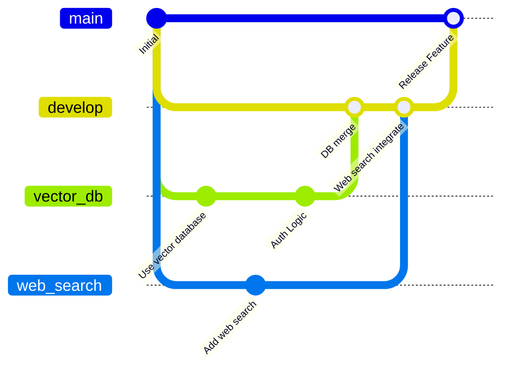

# agent_murdock

`agent_murdock` is an agentic RAG implementation for legal workflow.

### Tools used:
- `weaviate` as vector database
- `gemini` as agentic LLM
- `langgraph` as agentic framework
- `serper.dev` as web search tool
- `nomic-ai/nomic-embed-text-v1` as the embedder model

### Git workflow to follow

